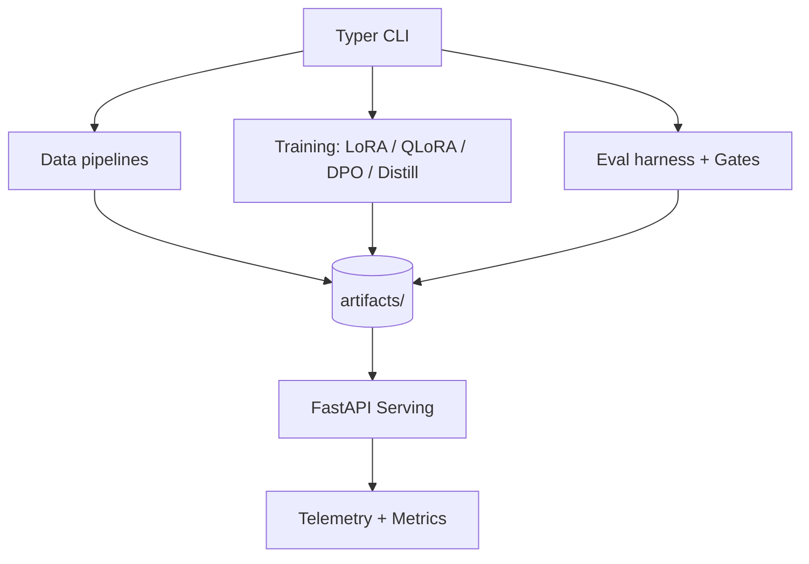

# LLM Customization Ops

A production-grade, end-to-end Python repo demonstrating LLM customization depth with LoRA/QLoRA fine-tuning, DPO preference tuning (RLHF-lite), and optional distillation. The project prioritizes testability, deployability, observability, and maintainability.

## What this repo demonstrates
- **LoRA SFT**: Parameter-efficient fine-tuning using PEFT.
- **QLoRA**: 4-bit quantized fine-tuning for limited hardware.
- **DPO**: Direct Preference Optimization (RLHF-lite) using TRL.
- **Optional distillation**: Minimal teacher -> student alignment loop.
- **Production features**: FastAPI service, OpenTelemetry traces, Prometheus metrics, JSON logs, CI gates.

## Architecture (high-level)


## Quickstart
```bash
make setup
make lint && make type && make test
make train-sft
make train-qlora
make train-dpo
make eval
make serve
```

## Proof (sample commands + outputs)
```bash
python -m llm_customization_ops.cli registry list
# summarization
# classification
# extraction

python -m llm_customization_ops.cli data make-sft --input-path src/llm_customization_ops/data/fixtures/sft.jsonl --output-dir artifacts/sft
# saved artifacts/sft

python -m llm_customization_ops.cli eval run
# {
#   "summarization": {"rouge_like": 1.0},
#   "classification": {"accuracy": 1.0},
#   "extraction": {"exact_match": 1.0}
# }
```

## Design decisions
- **Small base model**: default `sshleifer/tiny-gpt2` for CPU smoke runs.
- **Offline fixtures**: tiny datasets shipped in-repo, tests never require internet.
- **Configurable**: all pipelines accept CLI flags and env overrides.
- **Graceful degradation**: QLoRA detects missing bitsandbytes/GPU and exits with guidance.

## Extending prompt templates
Prompt templates are stored in `config/prompt_templates.json`. Add a new entry with a `version` and `template` (must include `{text}`), then validate:
```bash
python -m llm_customization_ops.cli registry validate
```

## CI gates
- Linting (ruff)
- Formatting (ruff format)
- Type checking (mypy)
- Pytest + coverage
- Docker image build
- Eval gate tests

## Repo layout
- `src/llm_customization_ops/`: application code
- `tests/`: unit + integration tests
- `docker/`: Dockerfiles + compose for serving and observability
- `docs/`: extended documentation
- `config/`: prompt templates, eval gates
- `artifacts/`: generated datasets, models, reports

## Serving demo
```bash
make serve
curl -X POST http://localhost:8000/v1/generate \
  -H 'content-type: application/json' \
  -d '{"prompt": "The cat sat on the mat.", "template_id": "summarization"}'
```

## Observability
- JSON logs with request_id
- OpenTelemetry traces (OTLP endpoint configurable)
- Prometheus metrics (`/metrics`)

See [docs/observability.md](docs/observability.md) for details.
